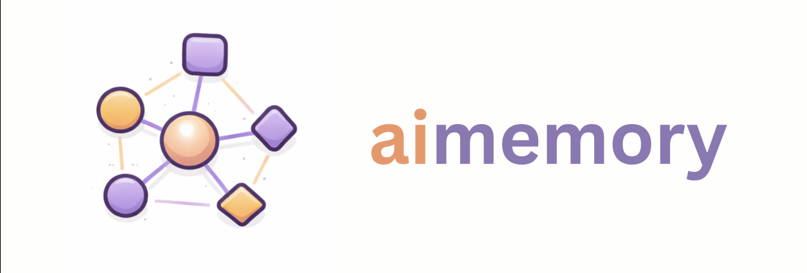

# aimemory

[](https://github.com/AvdienkoSergey/aimemory/actions/workflows/ci.yml)
[](LICENSE)

Context memory for AI agents. SQLite storage for entities and relations between them. It works with any domain — you can change the vocabulary to fit your project.



## Why

AI agent saves entities and relations into a graph, then answers questions about this graph. Out of the box it is set up for frontend (Vue/React), but you can change the kind types and relations for any stack — see [customization-guide.md](docs/customization-guide.md).

Examples of what you can build:

- **Frontend / backend code** — "who calls `fn:auth/login`?", "which components depend on `store:cart`?"
- **Microservices** — describe services, databases, queues as entities, connect them with `depends_on`. Ask: "which services will go down if `db:orders-pg` is not available?"
- **API contracts** — save endpoint schemas and their consumers. "If we change `schema:OrderResponse` — which clients will break?"
- **CI/CD pipelines** — describe stages, jobs, dependencies between repos. "Why are releases slow?" → AI sees that 6 teams wait for merges into one repo and suggests federation
- **Infrastructure** — servers, DNS, certificates, load balancers. "What will be affected by rotating `cert:api-gateway-tls`?"

## Architecture Decisions (ADR)

Key decisions are in [docs/adr/](docs/adr/):

| ADR | Decision |
|-----|----------|
| [001](docs/adr/001-lid-format.md) | LID format (`kind:path`) instead of UUID |
| [002](docs/adr/002-pending-refs.md) | Pending refs as a normal state |
| [003](docs/adr/003-flat-entity-data.md) | Flat entity.data structure |
| [004](docs/adr/004-type-contracts.md) | Type contracts (raw vs processed) |
| [005](docs/adr/005-layered-architecture.md) | Layered architecture |
| [006](docs/adr/006-typed-errors.md) | Typed errors |
| [007](docs/adr/007-pagination.md) | Query pagination |
| [008](docs/adr/008-mcp-stdio-transport.md) | MCP via stdio JSON-RPC |

## Documentation

- **[docs/usage-guide.md](docs/usage-guide.md)** — installation, MCP setup for Claude Code / Claude Desktop, prompts for first analysis
- **[docs/customization-guide.md](docs/customization-guide.md)** — how to add or remove kind and relation types for your stack
- **[docs/example-go-rest-api.md](docs/example-go-rest-api.md)** — full example for a Go backend project

## Architecture

```
┌─────────────────────────────────────────────────────────┐
│                      API Layer                          │
│  Mcp_server: JSON-RPC 2.0 stdio (aimemory mcp)          │
│  Tools.dispatch: JSON => Protocol.command => JSON result  │
└─────────────────────────────────────────────────────────┘
                            │
┌─────────────────────────────────────────────────────────┐
│                    Engine Layer                         │
│  Ingest: runs commands, orchestrates the pipeline       │
│  Resolver: resolves pending refs and glob queries       │
└─────────────────────────────────────────────────────────┘
                            │
┌─────────────────────────────────────────────────────────┐
│                   Storage Layer                         │
│  Repo: SQLite CRUD, transactions, migrations            │
│  Schema: DDL for entities, refs, meta tables            │
└─────────────────────────────────────────────────────────┘
                            │
┌─────────────────────────────────────────────────────────┐
│                    Domain Layer                         │
│  Lid: kind:path identifiers (comp:ui/Button)            │
│  Entity: raw => processed with timestamps               │
│  Ref: pending => resolved relations between entities    │
│  Protocol: command/response types for AI                │
└─────────────────────────────────────────────────────────┘
                            │
┌─────────────────────────────────────────────────────────┐
│                   Support Layer                         │
│  Log: structured logging to file                        │
└─────────────────────────────────────────────────────────┘
```

## Why OCaml

**Not Go:** The task is to classify entities (`comp`, `store`, `fn`...) and relations (`calls`, `depends_on`...). In Go these are strings — a typo and you find out at runtime. In OCaml these are variants — add a new kind and the compiler shows every place where you forgot to handle it.

**Not Rust:** Same type safety, but no fighting with the borrow checker. There is no complex memory management here — data comes in, gets saved to SQLite, goes out. Lifetime annotations would be pure overhead.

**Result:** Exhaustive pattern matching + ADT = the compiler catches forgotten cases. For domain-heavy code with a fixed set of categories — exactly what is needed.

## Key Concepts

### LID (Logical ID)

Unique identifier for an entity: `kind:path`

```
comp:ui/Button        — component
fn:useAuth:login      — function inside a composable
store:cart            — Pinia store
type:UserDto          — TypeScript type
dep:lodash            — external dependency
```

### Kind (entity type)

Default set is for Vue/frontend:

**Module level:**
- `comp` — component
- `view` — router page
- `layout` — layout wrapper
- `store` — Pinia/Vuex store
- `composable` — Vue composable
- `service` — service layer
- `util` — utilities
- `api` — API endpoint
- `dep` — npm package

**Inside a module:**
- `fn` — function/method
- `state` — reactive state
- `computed` — computed property
- `action` — store action
- `prop` — input prop
- `emit` — component event
- `hook` — lifecycle hook
- `type` — TypeScript type/interface

### Ref (relation)

A directed relation between two entities:

```
Button -[calls]-> fetchUsers
useAuth -[depends_on]-> authStore
Modal -[contains]-> CloseButton
```

Relation types: `belongs_to`, `calls`, `depends_on`, `contains`, `implements`, `renders`, `references`

### Pending vs Resolved

AI can describe code in any order. If a relation points to an entity that does not exist yet — it is saved as `pending`. When the target entity appears — the relation becomes `resolved` automatically.

## Usage

### CLI

```bash
# Save an entity
aimemory call emit '{"entities":[{"lid":"fn:auth/login","data":{"async":true}}]}'

# Query all functions
aimemory call query_entities '{"kind":"fn"}'

# Find relations from an entity
aimemory call query_refs '{"source":"fn:auth/login"}'

# Database status
aimemory status

# Reset the database
aimemory reset

# MCP server (stdio JSON-RPC for Claude Code / Claude Desktop)
aimemory mcp

# See available kind and relation types
aimemory kinds
aimemory rels

# Tool schemas for system prompt
aimemory schemas

# With logging
aimemory --verbose call emit '...'
aimemory --quiet status
```

### MCP Tools

MCP server (`aimemory mcp`) gives AI agents access to tools via JSON-RPC 2.0 stdio. Setup instructions are in [usage-guide.md](docs/usage-guide.md).

Tools:
- `emit` — upsert entities with relations
- `query_entities` — search by kind/pattern
- `query_refs` — search relations
- `status` — diagnostics (how many entities, resolved/pending refs)

## Adapt to Your Stack or Your Tasks

You can change kind and relation types for any stack. Full instructions: **[docs/customization-guide.md](docs/customization-guide.md)**, full example for Go backend: **[docs/example-go-rest-api.md](docs/example-go-rest-api.md)**.

## Build and Test

```bash
# Build
dune build

# Tests
dune runtest

# Run
dune exec aimemory -- status
```

## License

MIT
